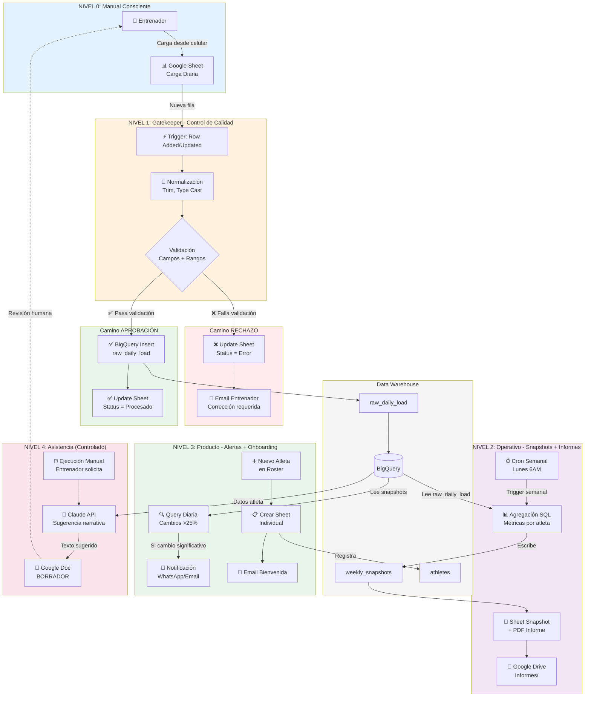

## Leyenda del Flujo

### Niveles de Madurez

| Nivel | Color | Objetivo | Estado en Demo |
|-------|-------|----------|----------------|
| **0** | Azul claro | Entrada manual, sin automatización | ✅ Visible explícitamente |
| **1** | Naranja claro | Control de calidad automático | ✅ Core de la demo |
| **2** | Púrpura claro | Snapshots y reportes periódicos | ✅ Muestra valor operativo |
| **3** | Verde claro | Alertas y onboarding | ✅ Diferenciación producto |
| **4** | Rosa claro | Asistencia IA controlada | ⚠️ Solo ejemplo limitado |

### Tipos de Nodos

- 🔵 **Círculo**: Trigger o evento
- 🔷 **Diamante**: Decisión/validación
- 🟦 **Rectángulo**: Proceso/acción
- 🗄️ **Cilindro**: Base de datos
- ☁️ **Nube**: Servicio externo

### Puntos Críticos de la Demo

1. **Feedback Loop** (NIVEL 1): 
   - El sistema escribe de vuelta en el Sheet del usuario
   - No es una caja negra

2. **Idempotencia** (NIVEL 1):
   - `Status_Sistema` previene reprocesamiento
   - Hash MD5 en BigQuery evita duplicados

3. **Operación sin fricción** (NIVEL 2):
   - Cron semanal: 0 intervención manual
   - Informes listos los lunes antes que llegue el entrenador

4. **Producto vs Proyecto** (NIVEL 3):
   - Onboarding automático
   - Alertas contextuales (no prescriptivas)

5. **IA como asistente** (NIVEL 4):
   - Siempre manual
   - Siempre marcado como borrador
   - Nunca reemplaza criterio
